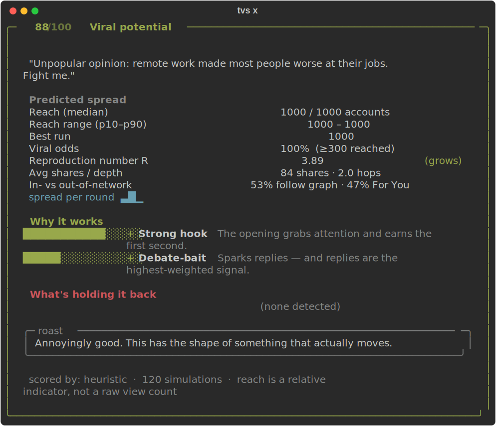

# TweetViralitySimulator

**Simulate whether your tweet spreads on X — before you post.**

Paste a tweet. It builds a synthetic X audience, models how the For-You
algorithm and the follower graph would carry it, runs thousands of simulations,
and tells you how far it spreads — and *why*.

Runs **fully locally, zero setup, no API key.** Score a draft, rewrite it for
spread (`tvs improve`), A/B two versions, or benchmark the model (`tvs validate`).

<p align="center">
  
</p>

<details>
<summary>plain-text version</summary>

```text
$ tvs x "Unpopular opinion: remote work made most people worse at their jobs. Fight me."

╭─  88/100   Viral potential ────────────────────────────────────────────────╮
│   Reach (median)            1000 / 1000 accounts                            │
│   Viral odds                100%  (≥300 reached)                            │
│   Reproduction number R     3.89  (grows)                                   │
│   In- vs out-of-network     52% follow graph · 48% For You                  │
│   spread per round          ▃█▄▂▁                                           │
│   ✓ Strong hook   ✓ Debate-bait                                             │
╰─────────────────────────────────────────────────────────────────────────────╯
```

</details>


## Quick start

```bash
pip install -e .
tvs x "Nobody talks about this AI trick that saves me 10 hours a week. Here's how:"
```

No keys, no accounts. You get the report card above in your terminal.

## Rewrite a tweet for more spread

Don't just score it — *fix* it. `tvs improve` generates rewrite candidates,
simulates **every one on the same synthetic audience**, and hands you the
winner with the predicted lift. The simulator is the judge, not the generator.

```text
$ tvs improve "Read my new blog post about productivity. https://example.com #tips"

╭─  ↑ +84 points   4 → 88 ────────────────────────────────────────────────────╮
│   ORIGINAL                                                                   │
│   "Read my new blog post about productivity. https://example.com #tips"      │
│   score 4/100 · Likely to fizzle · reach 60/500                              │
│                                                                              │
│  ╭─ BEST REWRITE · 88/100 · Viral potential ──────────────────────────────╮ │
│  │ Unpopular opinion: read my new blog post about productivity.            │ │
│  ╰──────────────────────────────────────────────────────────────────────╯ │
│   reach 500/500 · viral odds 100% · R 3.77                                   │
╰──────────────────────────────────────────────────────────────────────────────╯
```

Works with **zero setup** (a heuristic rewriter applies known viral formats to
*your* message). Point it at a model for real rewrites: `-p ollama` (local),
`-p openai`, or `-p compat` (any OpenAI-compatible endpoint).

## A/B test two drafts

The most useful mode — relative comparison is far more reliable than absolute
prediction. Both versions run on the **same** synthetic population.

```text
$ tvs compare "Read my new blog post about productivity https://example.com" \
              "Unpopular opinion: most productivity advice is procrastination in disguise."

╭─ A/B comparison ────────────────────────────────────────────────╮
│                              Version A            Version B       │
│   Virality score                 2/100               94/100       │
│   Verdict             Likely to fizzle      Viral potential       │
│   Reach (median)                    60                 1000       │
│   R                               0.00                 2.06       │
│                                                                  │
│   Version B is 16.7× more likely to spread than Version A        │
╰──────────────────────────────────────────────────────────────────╯
```

## More options

```bash
tvs x "your tweet"                  # score a tweet, zero setup
tvs improve "your tweet"            # rewrite for spread, ranked by the simulator
tvs improve "your tweet" -n 10      # try more rewrite candidates
tvs x "your tweet" -p ollama        # score the tweet with a local model
tvs x "your tweet" -p openai        # score with OpenAI (needs OPENAI_API_KEY)
tvs x "your tweet" -p compat        # score with any OpenAI-compatible endpoint
tvs x "your tweet" -a 2000 -r 200   # bigger audience, more runs
tvs x "your tweet" --profile p.json # load a calibration profile artifact
tvs x "your tweet" --json           # machine-readable output
tvs x "your tweet" --save card.svg  # export the report card as an image
tvs validate                        # score the model on the face-validity benchmark
tvs validate --tune                 # search for better simulation parameters
```

### Python API

```python
from tweet_virality_simulator import analyze, improve

report = analyze("Unpopular opinion: remote work made people worse at their jobs.")
print(report.virality_score, report.verdict)
for w in report.weaknesses:
    print("-", w.label, w.detail)

# Rewrite for spread — every candidate simulated on the same population.
result = improve("Read my new blog post about productivity. https://example.com")
print(f"+{result.lift()} points")
print(result.best().tweet)
```

### Validate the model

The open engine ships a **face-validity benchmark** — 24 hand-labeled tweets plus
directional invariants (links hurt, hooks help, etc.). Run it anytime to check
that the simulator still ranks tweets sensibly:

```bash
tvs validate
# rank_corr=+0.65  pair_acc=0.78  invariants=1.00  saturation=0.08
# tier means [T0:17 T1:18 T2:36 T3:88]  (dead → viral-shaped)

tvs validate --tune    # random-search Profile params to improve the benchmark
```

This is a **sanity check on priors**, not proof of real-world accuracy. The same
evaluation logic runs on **real outcome data** in the managed backend (see
below), which is what turns "plausible" into "grounded."

---

## How it works

```
tweet ──► Tweet DNA (hook, emotion, novelty, controversy, link penalty, ...)   [provider]
              │
        synthetic audience (interest embeddings + popularity + traits)
              │
        follower graph (power-law in-degree + homophily)
              │
   Monte Carlo cascade ×N, seeded & deterministic:
       • in-network channel   (retweets propagate to followers)
       • out-of-network channel (For-You injection: engagement-gated,
         similarity-targeted pools)
              │
        report: score · reach distribution · R · drivers / weaknesses
```

The LLM (optional) only *scores the tweet*. The simulation itself is pure,
seeded numpy — so the same tweet gives the same answer every run.

### Grounding

The For-You injection and engagement weighting are re-implemented **from the
publicly documented concepts** in X's open-sourced recommendation algorithm —
the ~50/50 in-network vs out-of-network candidate split and the heavy ranker's
asymmetric engagement weights (a reply the author engages back with is worth far
more than a like). No code is copied; that repo is AGPL-3.0 and this project is
Apache-2.0. Source of concepts: <https://github.com/twitter/the-algorithm>.

### How it keeps getting better

The simulated audience isn't static. The open engine is built around a
**continual-learning loop** — the code for the loop lives in the engine's
[seams](#extending-it); a separate **managed backend** (not in this repo)
implements the loop in production.

```
your tweet ──► simulator ──► prediction + features     [tracing hook → Postgres]
                                    │
              ┌─────────────────────┴─────────────────────┐
              │                                           │
    paste tweet link                          connect X (OAuth)
    (public metrics)                          (impressions + history)
              │                                           │
              └─────────────────────┬─────────────────────┘
                                    ▼
              label: rel_amplification vs author baseline
              (how many × better than *your* normal tweet — not raw reach)
                                    ▼
              temporal train/test → refit Profile → champion-challenger
                                    ▼
              promoted profile served on next request (no engine code change)
```

**Why relative amplification, not raw reach:** a 1M-follower account will almost
always beat a 1k account on impressions. The label measures whether *this*
content punched above the author's own baseline — the same thing the simulator
models (spread beyond the seed audience).

**Two outcome paths (both feed the same label):**

| Path | How | Signal |
| --- | --- | --- |
| **Author-authorized** | Connect X via OAuth | Impressions + engagement (best) |
| **Paste-a-link** | Submit a posted tweet URL | Public likes / RTs / replies (bootstrap) |

The open engine ships a tuned `default` profile and works **fully offline
forever**. The managed backend loads a **fitted profile** (and optionally a
trained model behind `compat`) via env/config — [no engine changes](#extending-it).
Accuracy compounds as more `(prediction, outcome)` pairs accumulate.

---

## Open-core architecture

This repo is the **engine** (Apache-2.0). Calibration data, fitted profiles, and
the hosted API live in a **private backend** that depends on this package and
attaches through four seams — the engine never imports anything closed.

```
┌─────────────────────────────────────────────────────────────┐
│  TweetViralitySimulator (this repo)                         │
│  analyze · improve · compare · validate                     │
│  Profile · tracing · storage · providers                      │
└──────────────────────────┬──────────────────────────────────┘
                           │ seams (no fork)
┌──────────────────────────▼──────────────────────────────────┐
│  Managed backend (private)                                  │
│  FastAPI · Supabase · outcome ingestion · cron retrain        │
│  champion-challenger promotion · fitted Profile + model       │
└─────────────────────────────────────────────────────────────┘
```

## Extending it

The engine is pluggable by design — every part you'd want to swap is behind a
clean seam, so you can bring your own model, calibration, and infrastructure
**without editing the engine**.

| Seam | What it's for | How to attach |
| --- | --- | --- |
| **Provider** (`providers/`) | the tweet scorer | built-in `heuristic` / `openai` / `ollama`, or `compat` for any OpenAI-compatible endpoint (incl. your own fine-tuned model) |
| **Profile** (`profile.py`) | every tunable number — reaction scales, network shape, algo thresholds, trait priors | ship a fitted `Profile` JSON and load it at runtime; the engine code never changes |
| **Tracer** (`tracing/`) | emit one `(tweet, dna, params, prediction)` record per run | no-op by default; set `TVS_TRACE_PATH` for local JSONL, or register a sink (managed backend → Postgres) |
| **Store** (`storage/`) | persist reports / datasets / artifacts | `LocalStore` (JSON on disk) ships by default; the managed backend implements `Store` on Supabase/Postgres |

```python
from tweet_virality_simulator import analyze, Config, Profile, load_profile

# Calibration lives in data, not code — load a fitted profile artifact.
report = analyze("your tweet", Config(profile_path="fitted_x.json"))

# Or build/override one programmatically.
profile = Profile(name="my_fit", promotion_threshold=0.7, appeal_scale=1.9)
report = analyze("your tweet", profile=profile)
```

```python
# Point the engine at any OpenAI-compatible model server.
import os
os.environ["TVS_COMPAT_BASE_URL"] = "https://your-endpoint/v1"
os.environ["TVS_COMPAT_API_KEY"]  = "..."          # optional
report = analyze("your tweet", Config(provider="compat"))
```

```python
# Wire your own outcome sink (the data flywheel) without touching the engine.
from tweet_virality_simulator import set_tracer, Tracer

class MySink(Tracer):
    def emit(self, record: dict) -> None:
        ...  # ship to your warehouse / queue

set_tracer(MySink())
```

Config resolution is explicit-arg → env var → built-in default, so nothing
proprietary is required to run: the open package ships only the generic
`default` profile and a local store, and works fully standalone.

---

## Status & honest roadmap

- **v0.1 (shipped):** mechanistic simulator with tuned priors — `tvs x`,
  `tvs compare`, `tvs improve`, report cards, SVG export. Reproduces known effects
  (hooks/emotion lift spread, links suppress it). All tunable numbers live in a
  loadable [`Profile`](#extending-it); provider, tracing, and storage seams are
  in place. Default profile tuned via the face-validity benchmark (~0.65 rank
  correlation, zero saturation on strong tweets).
- **v0.2 (shipped):** validation harness — `tvs validate` reports rank
  correlation, tier separation, saturation, and directional invariants;
  `tvs validate --tune` searches the `Profile` for better params. Priors-based
  sanity today; same metrics on real outcomes in the managed backend.
- **v0.3 (in progress):** continual-learning backend — prediction logging
  ([`tracing`](#extending-it)), dual outcome ingestion (OAuth + paste-a-link),
  `rel_amplification` labels, temporal eval, champion-challenger profile
  promotion. Engine unchanged; backend attaches via seams.
- **Next:** accumulate real outcome data → publish a benchmark showing fitted
  profile beats default → optional trained reaction model behind `compat` →
  hosted API for users who don't want to self-host.

> **Read the numbers as relative signals**, not guaranteed view counts. Even X
> can't perfectly predict virality. The open tool is useful for comparing drafts
> and finding weak points; the managed backend is what makes predictions
> *grounded* over time.

## License

Apache-2.0.
